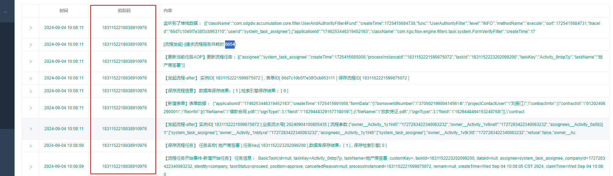

# 系统运行记录集成方案


系统运行记录模块旨在记录系统运行时的数据，帮助开发者了解系统运行情况，以及通过运行数据确认系统问题，减少对接调试时间。


## 第一步 : Maven 引入依赖

```xml
<dependency>
    <groupId>cn.aio1024.runtime</groupId>
    <artifactId>runtime-record-spring-boot-starter</artifactId>
    <version>1.1.2</version>
</dependency>
```

> 当前最新版本为 `1.1.2`

> 日志追踪需要依赖阿里的线程工具 `transmittable-thread-local` 日志追踪码与线程关联

> 日志存储和查询需要依赖 `Lucene` , Lucene 仅能实现单机日志

> 系统运行时 日志级别设置 , 系统配置 , Bean管理 等模块 需要依赖 `actuator` 。

> 统一用户中心接口，和 `controller` 返回值对象等需要依赖 `basic-all`

> 接口请求使用了AOP拦截需要依赖 `aspectj`


## 第二步 ,配置系统工作目录

```properties
project.workspace.path=/home/guodun/workspace/electronic
```


> 项目工作目录定义在基础框架底层包中，可以为日后模块化功能提供统一的项目工作目录配置。


## 第三步,启动自带的用户权限模块

```properties
aio.runtime.security.enable=true
aio.runtime.security.username=guodun
aio.runtime.security.password=jldfasfsfsdflsfjasfsdfjsjf
```

> `aio.runtime.security.username` 默认值为 admin 。 表示 登录的用户名

> `aio.runtime.security.password` 默认值为 `guodun@2024`  登录密码。

> `aio.runtime.security.enable` 表示启动默认的用户权限 , 默认值为 false ，表示不启动默认的权限

后续版本会支持客户化账号密码登录

# 功能模块

1. 接口访问记录 。 接口访问记录会记录 接口地址，请求方式，请求参数，相应结果，请求人，请求人姓名，请求企业ID，请求企业名称，访问时间，追踪码，异常类，异常信息，异常堆栈信息等。
2. 日志订阅。通过日志的Marker功能标记特定的日志，日志会自动存储，日志订阅模块可以查询和处理被标记的日志。
3. 项目配置。可以查询当前spring boot 的所有配置信息。
4. bean查询。查询当前项目的所以Spring bean
5. 接口查询。查询当前项目下的所有接口API。
6. 日志查询与存储。可以保存查询方案，持久化。 日志存储使用 Lucene ,经过测试 200 万 日志每天,检索性能可以做到一秒以内。
7. 日志级别查询，与日志级别设置。

访问地址 ：

```shell
/view/runtime
```

## 第四步，添加日志追踪码

```java
@Slf4j
@Configuration
public class ServletWebInterceptorConfig implements WebMvcConfigurer {

    @Override
    public void addInterceptors(InterceptorRegistry registry) {
        registry.addInterceptor(new TraceIdInterceptor()).addPathPatterns("/**");
    }
}
```

> servlet 中添加 `TraceIdInterceptor` 拦截器 ，拦截器会使用雪花算法标记线程 ，并且记录到日志中。效果如下图





## 日志订阅使用方式

示例代码如下 ：
```java
log.error(SubscribeMarker.getMarker("MappingsEndpoint"), "读取接口信息失败。MappingsEndpoint 未注入。请引入 spring-boot-starter-actuator 模块，并且开启MappingsEndpoint ");
```

只需要在打印日志时，添加一个标签声明，控制台也可以通过这个标记查询这个标记的所有订阅日志。


## 更新日志 

### 1.1.3

1. 添加日志追踪码拦截器
2. 修改接口请求路径接口不一致，导致集成复杂问题
3. 默认开启日志组件安全功能
